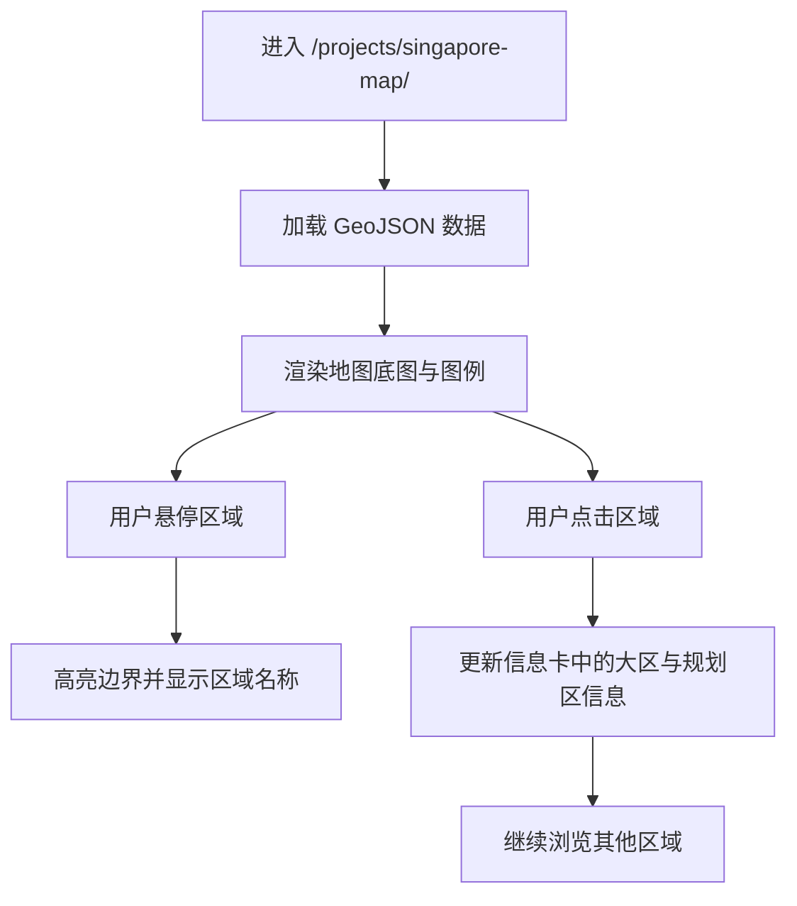

## 1. 产品概述
`singapore-map` 是一个放置在 `projects/` 目录下的单页可视化项目，用 D3 渲染新加坡行政分区地图，并支持基础交互浏览。
- 主要解决“如何把本地 GeoJSON 数据清晰、准确地呈现在网页中”的问题，面向需要查看新加坡区域分布的访问者。
- 项目价值在于为后续叠加人口、机构、语言或研究分布数据提供稳定底图与交互骨架。

## 2. 核心功能

### 2.1 功能模块
1. **地图主页**：标题区、说明文字、D3 地图画布、交互信息卡。
2. **地图交互层**：区域悬停高亮、点击锁定、区域名称与所属大区展示。
3. **辅助信息层**：图例、数据来源、使用说明、响应式缩放。

### 2.2 页面详情
| 页面名称 | 模块名称 | 功能描述 |
|----------|----------|----------|
| 地图主页 | 顶部说明区 | 展示项目标题、用途说明、数据来源简介 |
| 地图主页 | 新加坡地图 | 基于本地 `district_and_planning_area.geojson` 绘制 55 个规划区边界 |
| 地图主页 | 区域着色 | 依据 `district` 字段为 East / West / North / North-East / Central 等大区分配颜色 |
| 地图主页 | 悬停交互 | 鼠标移入时高亮区域并显示规划区名称 |
| 地图主页 | 点击交互 | 点击后在侧边信息卡中锁定显示 `planning_area` 与 `district` |
| 地图主页 | 图例与注释 | 解释颜色含义、说明当前版本仅展示边界分布而未叠加统计值 |

## 3. 核心流程
用户进入页面后，首先看到新加坡地图总览与说明文字；移动鼠标浏览各区域时可即时读取名称；点击某一区域后，右侧信息卡固定显示该区域详细信息；再次点击其他区域时更新当前选中状态。

## 4. 用户界面设计
### 4.1 设计风格
- 主色：深海军蓝背景搭配低饱和分区色，突出地图精度与学术可读性
- 辅色：米白文字、浅灰描边、青绿色交互高亮
- 按钮风格：仅保留轻量交互控件，不做厚重按钮设计
- 字体与字号：标题使用有识别度的衬线字体，正文使用清晰的无衬线字体；地图标签避免过小
- 布局风格：桌面端采用“地图主画布 + 右侧信息卡”双栏结构，移动端改为上下堆叠
- 图标风格建议：少量线性图标，强调信息密度与阅读秩序

### 4.2 页面设计概览
| 页面名称 | 模块名称 | UI 元素 |
|----------|----------|---------|
| 地图主页 | 顶部说明区 | 紧凑标题、简短引导语、数据说明文字 |
| 地图主页 | 地图画布 | 大面积留白、清晰边界线、柔和分区填色、悬停描边动画 |
| 地图主页 | 信息卡 | 选中区域名称、大区字段、状态提示、当前数据范围说明 |
| 地图主页 | 图例区 | 色块与大区名称对应关系、底图说明 |

### 4.3 响应式设计
- 采用桌面优先设计，优先保证大屏上的地图细节完整显示
- 在平板与手机宽度下自动改为纵向布局，地图保持完整比例
- 触屏设备使用点击代替悬停信息呈现
