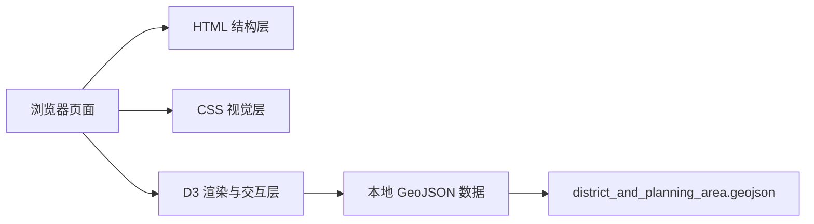
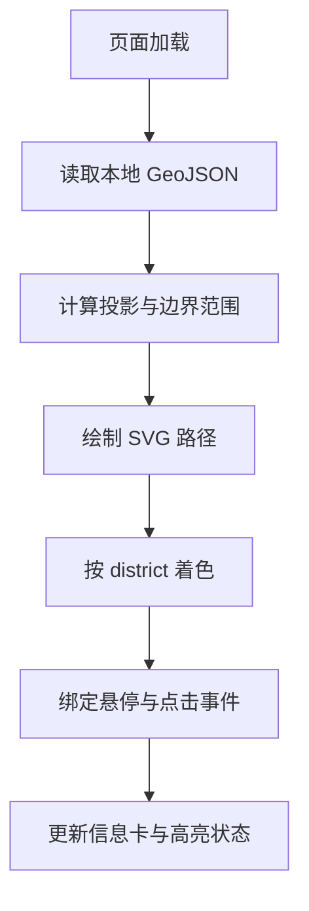

## 1. 架构设计
该项目采用纯前端静态架构，直接部署在现有 Jekyll 站点的 `projects/singapore-map/` 目录下。页面通过 D3 加载本地 GeoJSON 数据并在浏览器端完成投影、渲染与交互，无需后端服务。



## 2. 技术说明
- 前端：HTML5 + CSS3 + JavaScript ES Modules
- 可视化：D3.js v7
- 数据格式：GeoJSON
- 部署方式：作为静态页面纳入现有 Jekyll 仓库
- 初始化方式：直接使用现有仓库目录结构，不引入额外构建工具

选择纯静态方案而非 React 的原因是：当前仓库的 `projects/` 子项目主要以独立静态页面组织，D3 与 GeoJSON 的依赖关系简单，直接接入更符合现有工程结构，也便于后续复制为其他地图项目模板。

## 3. 路由定义
| 路由 | 用途 |
|------|------|
| `/projects/singapore-map/` | 新加坡地图主页，展示区域分布与交互信息 |

## 4. 数据定义
### 4.1 GeoJSON 属性结构
```ts
type SingaporePlanningAreaFeature = {
  type: "Feature";
  properties: {
    district: string;
    planning_area: string;
  };
  geometry: GeoJSON.Polygon | GeoJSON.MultiPolygon;
};
```

### 4.2 前端状态结构
```ts
type MapViewState = {
  hoveredArea: string | null;
  selectedArea: string | null;
  selectedDistrict: string | null;
};
```

## 5. 渲染流程
1. 页面初始化后加载本地 GeoJSON 文件。
2. 使用 `d3.geoMercator()` 或 `d3.geoIdentity().fitSize()` 将数据适配到 SVG 画布。
3. 遍历 GeoJSON features 生成区域路径。
4. 基于 `district` 字段建立颜色映射。
5. 绑定 `mouseenter`、`mouseleave`、`click` 事件，更新高亮和信息卡。
6. 在窗口尺寸变化时重新计算画布尺寸与投影。



## 6. 文件结构规划
| 路径 | 用途 |
|------|------|
| `projects/singapore-map/index.html` | 页面结构与挂载点 |
| `projects/singapore-map/styles.css` | 页面样式、布局与响应式规则 |
| `projects/singapore-map/app.js` | D3 地图渲染与交互逻辑 |
| `projects/singapore-map/district_and_planning_area.geojson` | 新加坡规划区边界数据 |

实现阶段优先复用已有的 `projects/sinmap/district_and_planning_area.geojson` 数据文件，可复制到新目录以保证项目自包含。

## 7. 性能与兼容性
- SVG 路径数量约 55 个，浏览器端渲染压力很低
- 避免引入额外框架与打包流程，减少站点维护成本
- 保证现代桌面浏览器可用，并兼容移动端触控点击
- 首屏资源保持精简，地图数据使用本地静态文件加载
