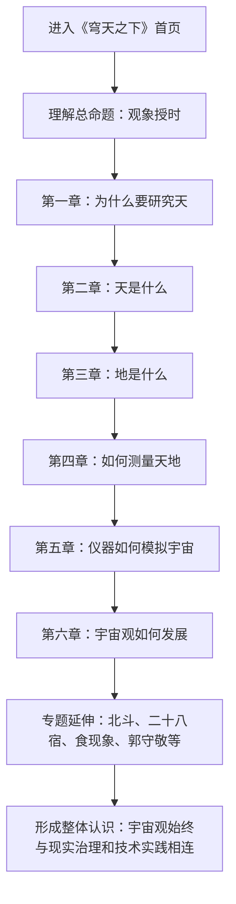

## 1. 产品概述
`穹天之下` 是一个面向普通读者与学生的中国古代宇宙观交互叙事项目，以六章主线解释“中国人为什么研究天、怎样理解天与地、又如何测量和模拟宇宙”。
- 项目核心不是罗列知识点，而是建立一条清晰论证链：`观象授时` -> 宇宙模型 -> 地的认识 -> 实测方法 -> 仪器模拟 -> 现代延续。
- 目标价值是把抽象、易被误解的“中国古代天文与宇宙论”转化成可视、可拖动、可比较的体验，让用户形成结构化理解，而不是只记住零散术语。

## 2. 核心功能

### 2.1 用户角色
本项目为公开浏览型单人阅读体验，不区分用户角色。

### 2.2 功能模块
1. **首页/总览页**：英雄区、核心命题、六章导航、专题入口、资料出处。
2. **六章叙事模块**：每章一个核心问题、一个交互装置、一个结论句，按纵向滚动推进。
3. **专题补充模块**：北斗、二十八宿、食现象、张衡与浑仪、郭守敬与授时历、哲学文本等独立知识卡。
4. **证据与引文模块**：原典短引、人物时间线、术语解释、史实边界说明。

### 2.3 页面详情
| 页面名称 | 模块名称 | 功能说明 |
|-----------|-------------|---------------------|
| 首页 | 英雄区 | 用强视觉“天幕 + 天球 + 书法标题”建立项目气质，提出总问题“我们身处怎样的宇宙？” |
| 首页 | 主论点条带 | 明确指出中国研究天文的出发点不是抽象好奇，而是历法、农业、祭祀、皇权与时间统一，落点为“观象授时”。 |
| 首页 | 第一章：为什么研究天 | 以卡片与动态图示呈现历法、农业、祭祀、皇权、时间统一五个现实动因，并引入北斗、二十八宿、四象、节气。 |
| 首页 | 第二章：天是什么 | 用三个并列宇宙模型展示盖天说、浑天说、宣夜说；重点强化浑天说与“天包地外，如壳裹黄”的真实含义，并展示浑仪雏形。 |
| 首页 | 第三章：地是什么 | 通过多阶段图示说明古代中国对“地”的理解并不统一，强调有限大地、地表弧度认识与“为何未发展为地球学说”的讨论。 |
| 首页 | 第四章：如何测量天地 | 以互动实验呈现圭表测影、漏刻、北极高度、子午线测量，重点突出一行与南宫说的观测网络。 |
| 首页 | 第五章：仪器如何模拟宇宙 | 用机械感最强的一章展示浑仪、浑象、水运仪象台，强调“模型如何决定仪器设计”。 |
| 首页 | 第六章：宇宙观的发展 | 以演化链条总结从盖天、浑天、宣夜到历法、测量、仪器、数学天文学，再连接到北斗导航、FAST、天宫、嫦娥。 |
| 首页 | 专题补充区 | 以独立卡片承载北斗七星定位、二十八宿体系、中国宇宙坐标系、食现象解释、张衡与浑天仪、郭守敬与授时历、宇宙观与哲学。 |
| 首页 | 原典与资料区 | 展示《周髀算经》《淮南子》《浑天赋》等文本摘句，并标明现代解读边界。 |

## 3. 核心流程
用户进入页面后，先被“穹天之下”的视觉与总问题吸引，再通过第一章理解“研究天”的现实动机。随后用户按六章主线逐步建立中国古代宇宙观的层次：先理解天的三种模型，再理解地的多种设想，再进入测量与仪器章节，看见古人如何把宇宙从思想对象变成观测对象、再变成机械对象。最后用户在总结章看到古代宇宙观与现代中国航天、天文工程之间的连续性，并可进入专题卡片做横向延伸阅读。

## 4. 用户界面设计

### 4.1 设计风格
- 主色调：夜空青黑、古纸米白、铜金、朱砂红、黛青灰。
- 按钮风格：细边框、无圆角或极小圆角、带器物感的悬停反馈，避免现代 SaaS 风按钮。
- 字体与字号：标题使用书法/碑刻气质字体，正文用宋体系或衬线字体，英文或数字说明用简洁无衬线。
- 布局风格：纵向章节叙事 + 每章一个大型舞台式交互区，左侧为问题与结论，右侧为实验或图示。
- 图标/意象建议：北斗、环轨、圭表、漏刻、天球、铜环、刻度、星宿名、古纸纹理。

### 4.2 页面设计概览
| 页面名称 | 模块名称 | UI 元素 |
|-----------|-------------|-------------|
| 首页 | 英雄区 | 深色天幕背景、天球轮廓、书法大标题“穹天之下”、一句总问题、下滑入口 |
| 首页 | 第一章 | 五个现实动因卡片、北斗与节气的导入动线、金石质感标签 |
| 首页 | 第二章 | 三种宇宙学并列结构图，浑天说中央放大，配引用与人物节点 |
| 首页 | 第三章 | 地的认识演变示意、弧度/有限地面可视化、问题式注释 |
| 首页 | 第四章 | 可拖动影长、北极高度与站点距离交互，观测网络线图 |
| 首页 | 第五章 | 机械仪器剖面感布局、旋转环、报时节奏、分层动画 |
| 首页 | 第六章 | 纵向演化链与现代工程对照，收束情绪最强 |
| 首页 | 专题区 | 多张独立专题卡，可跳转到锚点或弹出扩展说明 |
| 首页 | 资料区 | 原典引文块、人物年代轴、史实边界说明文字 |

### 4.3 响应式
- 默认采用桌面优先，因为本项目核心价值在章节舞台、长横向标尺与大图示表达。
- 平板端保留主要交互，但减少同时出现的信息层数。
- 手机端改为单列堆叠，复杂动画降级为简化版示意图与关键数字。

### 4.4 动效与交互指导
- 章节切入使用缓慢、庄重的显隐与位移动画，避免轻浮跳跃感。
- 核心交互集中在“拖动”“对比”“点亮”“旋转”，让用户像在做观测实验，而不是在点击 PPT。
- 星空、铜环、刻度和纸本纹理应有轻微环境动感，但不得抢走主叙事。
- 每章都应有一句可被用户带走的“结论句”，在交互完成后高亮呈现。
