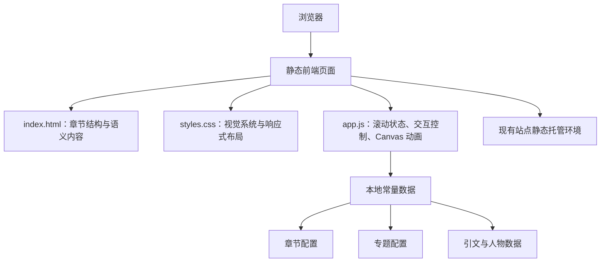
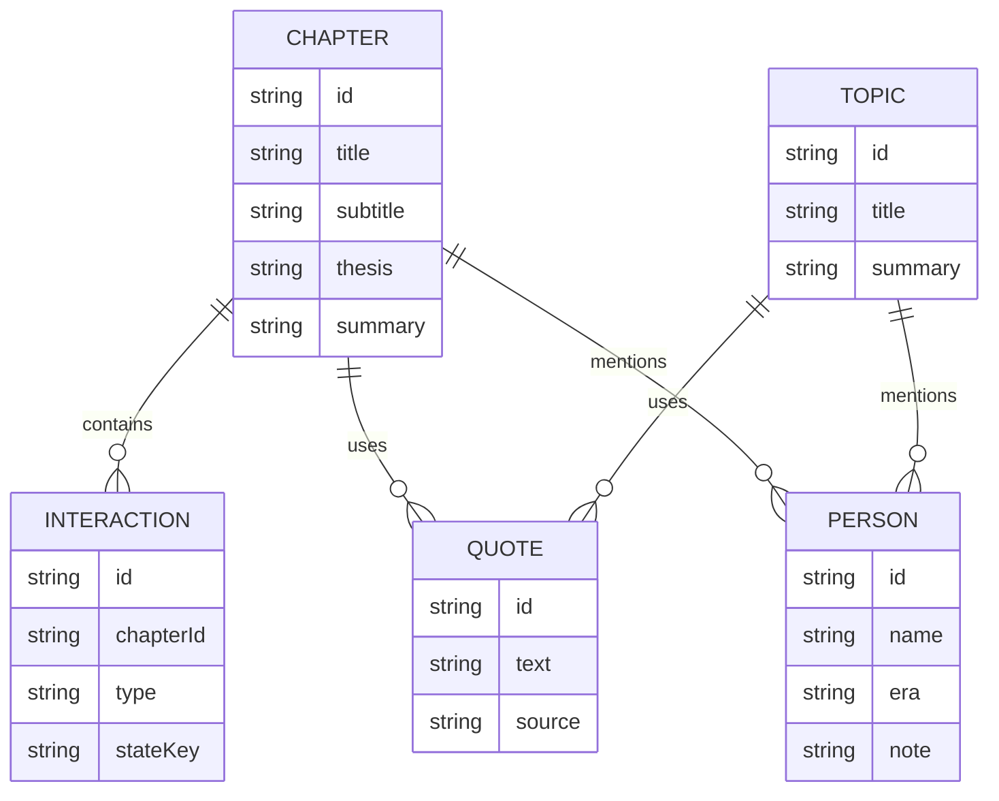

## 1. 架构设计



## 2. 技术说明
- 前端：HTML5 + CSS3 + Vanilla JavaScript
- 动画方式：CSS 动画 + Canvas 2D + 少量 DOM 状态切换
- 初始化方式：直接在 `projects/穹天之下/` 下采用单目录静态项目结构
- 发布方式：沿用当前仓库的静态站点方式，无需额外构建链

选择静态单目录实现的原因：
- 与现有 `projects/chinese-calendar`、`projects/chinese-coordinates` 等项目保持一致，便于后续维护。
- 本项目主要是叙事页面与定制交互，不依赖复杂状态管理或后端服务。
- 可以最快速地与现有 Jekyll/GitHub Pages 发布环境兼容。

## 3. 路由定义
| 路由 | 用途 |
|-------|---------|
| `/projects/qiongtian/` | `穹天之下` 中文主页面，包含六章主线、专题补充与资料区 |

说明：
- 文件夹物理路径建议使用 ASCII 目录名，例如 `projects/qiongtian/`，页面标题保留中文 `穹天之下`。
- 如需后续做英文版，可扩展 `/projects/qiongtian/en.html`。

## 4. 模块定义

### 4.1 页面模块
| 模块 | 职责 |
|------|------|
| 英雄区模块 | 呈现题名、总论点、导航与首屏动态天球 |
| 章节导航模块 | 提供六章锚点导航与滚动高亮 |
| 章节舞台模块 | 为每一章承载独立交互与结论文案 |
| 专题卡片模块 | 提供横向扩展阅读内容与快速跳转 |
| 资料出处模块 | 呈现原典摘引、参考来源与边界说明 |

### 4.2 交互模块
| 模块 | 职责 |
|------|------|
| 滚动进度模块 | 更新顶部阅读进度与章节激活状态 |
| 模型切换模块 | 切换盖天说、浑天说、宣夜说的可视表示 |
| 测量实验模块 | 响应拖动输入，更新影长、角度、距离与结论 |
| 仪器动画模块 | 驱动浑仪环、浑象旋转与机械节奏动画 |
| 专题展开模块 | 控制补充卡片的展开、折叠或锚点定位 |

## 5. 数据定义

### 5.1 数据模型定义


### 5.2 前端数据结构
```ts
type Chapter = {
  id: string;
  navLabel: string;
  title: string;
  subtitle: string;
  thesis: string;
  summary: string;
  interaction: "cards" | "cosmology" | "terrain" | "measurement" | "instrument" | "timeline";
};

type TopicCard = {
  id: string;
  title: string;
  summary: string;
  relatedChapter: string;
};

type QuoteItem = {
  id: string;
  text: string;
  source: string;
  relatedId: string;
};
```

## 6. 文件结构
```text
projects/qiongtian/
├── index.html
├── styles.css
└── app.js
```

如需进一步降低 `app.js` 复杂度，可在不改变单目录风格的前提下增加：

```text
projects/qiongtian/
├── index.html
├── styles.css
├── app.js
└── data.js
```

## 7. 视觉与实现约束
- 必须延续仓库既有“章节叙事型华夏项目”风格，而不是常规展板式网页。
- 标题字体、配色与细节要与 `经天纬地`、`华夏历法的时间机器` 同属一个家族，但不能直接复制。
- 每章至少有一个“用户能操控并得到反馈”的交互，不做纯静态长文。
- 内容上要严守史实边界，避免把类比写成史实，避免把现代术语直接投射成古代概念。

## 8. 实施步骤
1. 建立 `projects/qiongtian/` 目录与基础文件。
2. 完成 HTML 章节骨架与锚点导航。
3. 搭建 CSS 变量、字体系统、英雄区与章节版式。
4. 依次实现六章交互：先做结构最核心的第二、第四、第五章，再补第一、第三、第六章。
5. 补充专题卡片、引文区和资料区。
6. 做桌面与移动端适配。
7. 本地验证滚动、交互、布局和内容准确性。

## 9. 风险与应对
- 风险：六章内容过长，首屏后密度失衡。
  - 应对：每章只保留一个核心问题、一个核心交互、一个核心结论，其余内容放入专题卡。
- 风险：宇宙学模型容易被画成抽象示意，缺乏“可理解性”。
  - 应对：始终用“解释什么现象、解决什么问题、哪里解释不了”的三段式来组织。
- 风险：动画过多削弱学术感。
  - 应对：控制动画节奏，采用仪器式、刻度式、观测式动效，不做花哨漂浮装饰。
